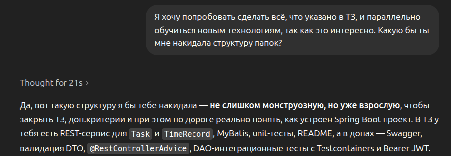
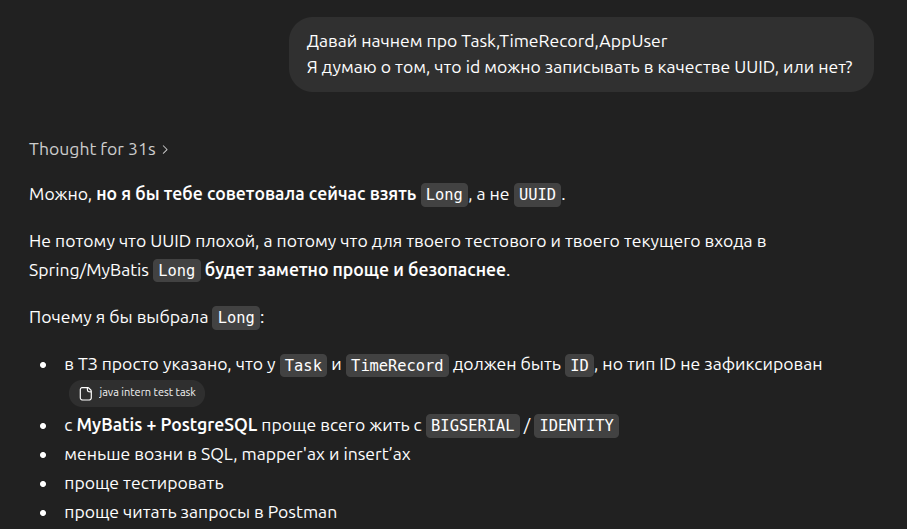
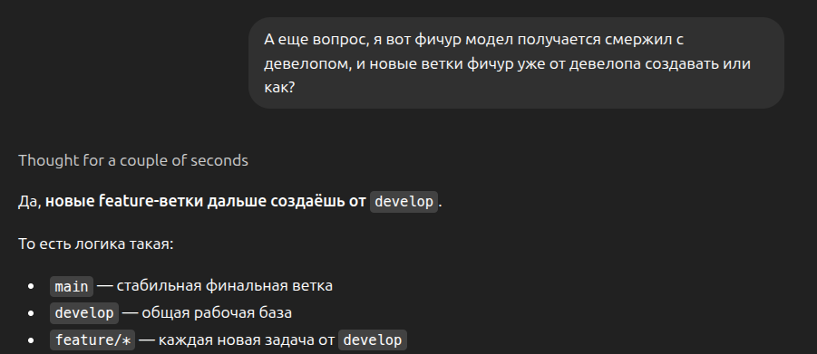
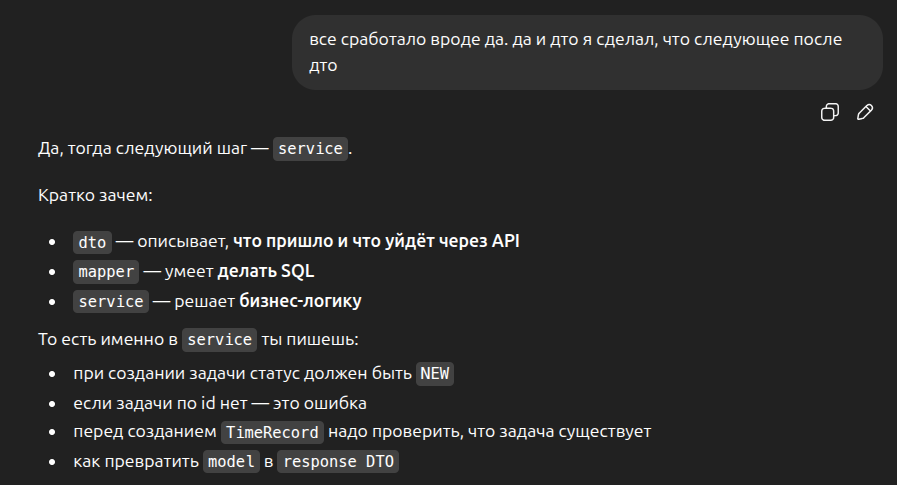
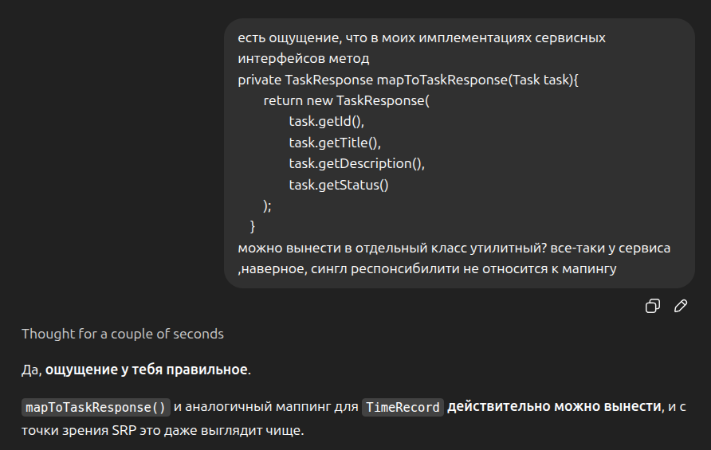

# Использование ИИ в проекте

### Зачем использовался ИИ (ChatGPT Thinking)

ИИ использовался как вспомогательный инструмент по:
- проектирования структуры проекта
- анализа кода на code smells
- настройки JWT-аутентификации
- восполнению некоторых пробелов в знаниях и нахождению best practises

Следует упомянуть, что весь код, местами
предложенный ИИ - был адаптирован и переписан
вручную, а не использован Ctrl+C - Ctrl+V :)

В основном пользуюсь как ментором, чтобы 
не браться за всё подряд, а структурированно идти по
плану и учиться так же делать в будущем самому.

Ниже будут приведены некоторые примеры промптов
и полученных ответов

### 1. Определение структуры проекта

В результате была выбрана классическая слоистая
структура, где у каждого пакета своя ответственность

### 2. Обсуждение решения UUID vs Long id

В результате был использован Long для хранения id,
но в целом можно реализовать и с помощью UUID для более
"энтерпрайз" подхода

### 3. Вопрос по Git Flow

### 4. Запрос следующего шага (несколько промптов подобного плана)

### 5. Обсуждение выноса маппинга из сервисов

### 6. Улучшение хэндлера всех эксепшнов

